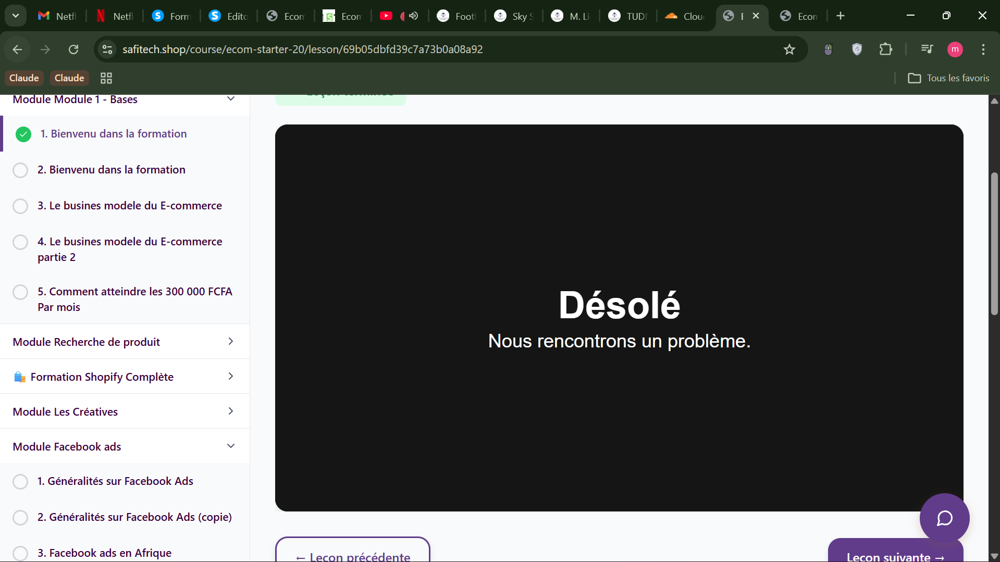

# Configuration pour le déploiement Cloudflare Pages

## IMPORTANT: Configuration manuelle requise dans Cloudflare Dashboard

Le wrangler.toml est ignoré par Cloudflare Pages pour la configuration de build.
Vous devez configurer manuellement dans le dashboard Cloudflare Pages :

### 1. Allez dans votre projet Cloudflare Pages
### 2. Cliquez sur "Settings" → "Build and deployments"
### 3. Configurez ces valeurs exactement :

**Root directory:**
```
frontend
```

**Build command:**
```
npm run build
```

**Build output directory:**
```
dist
```

**Node.js version:**
```
18
```

### 4. Sauvegardez et redéployez

## Pourquoi l'erreur persiste ?

Cloudflare Pages utilise sa propre configuration et ignore le wrangler.toml pour les paramètres de build.
L'erreur "Cannot find cwd: /opt/buildhome/repo/ecom-frontend" signifie que l'ancienne configuration est encore active.

## Structure du projet

```
plateforme/
├── frontend/          ← ROOT DIRECTORY (c'est ici que Cloudflare doit chercher)
│   ├── package.json   ← Dépendances et scripts
│   ├── vite.config.js ← Configuration Vite
│   ├── src/           ← Code source React
│   ├── public/        ← Fichiers statiques
│   └── dist/          ← BUILD OUTPUT DIRECTORY (généré par npm run build)
├── backend/           ← Backend (non utilisé par Pages)
└── wrangler.toml      ← Configuration limitée pour Pages
```
